# FlaskNotes

This project is a **web application** built with Flask that allows users to efficiently **manage and search notes**. It offers the following features:

## Features
- **Create, edit, and delete notes**: Users can manage their notes with ease through a simple interface.
- **Advanced search**: An optimized search system helps users find relevant notes quickly.
- **User authentication**: Secure login and logout functionality ensures that only authorized users can access their data.
- **Session handling**: The app maintains user sessions, so they don't need to log in repeatedly.
- **Paginated results**: When searching or viewing notes, results are displayed in pages for better navigation.

## Technology Stack
- **Flask**: The core framework used to build the application.
- **Jinja2**: For rendering HTML templates dynamically.
- **Flask-Session**: Used to handle user sessions securely.
- **SQLite/MySQL** (or any other DB): Database integration for storing user and note data.

## How It Works
1. **User Management**: Users can sign in and out, with session data being stored securely.
2. **Note Management**: Users can create, view, edit, and delete their notes.
3. **Search System**: The app includes a robust search feature to quickly find specific notes.
4. **Pagination**: Large search results are paginated for easier browsing.

## Page views 
 ### 
 1. **Main page.**  
 first view to open the page.  

    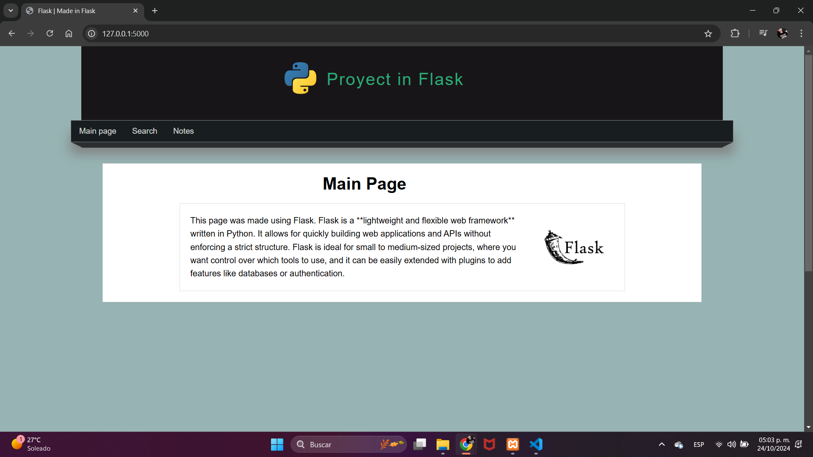
    
2. **Search Sage.**  
    Page where the search starts.
    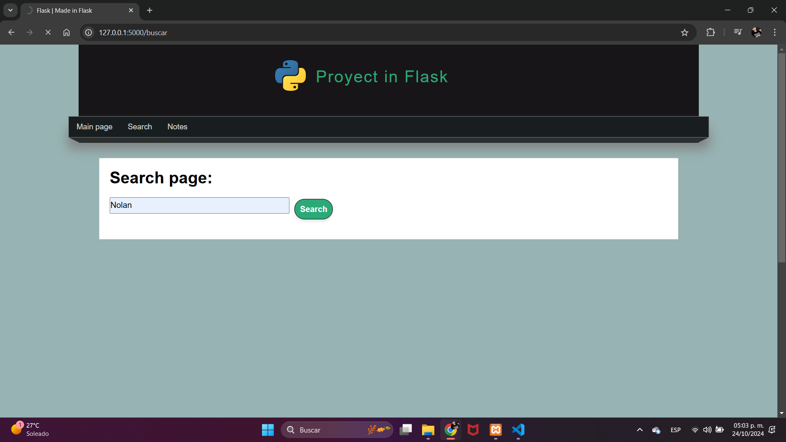
3. **Result of search.**  
    View of the results obtained for the "Nolan" search.
    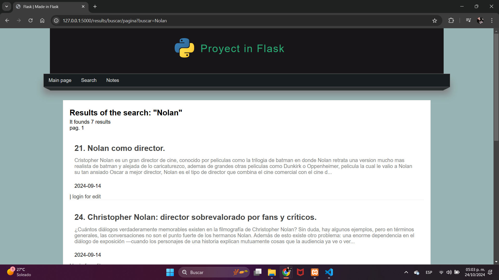
4. **Show All Notes.**  
    View of notes page where all notes stands.
    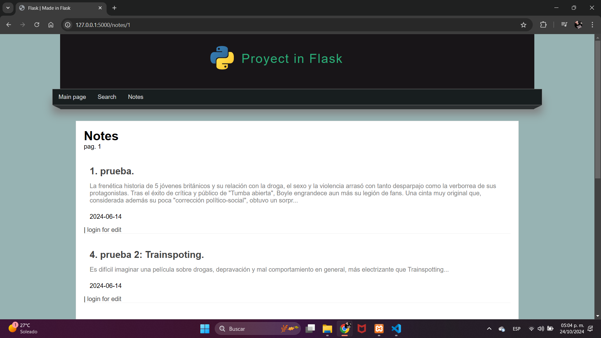
5. **Note Page.**  
    View obtained for select and click a note.
    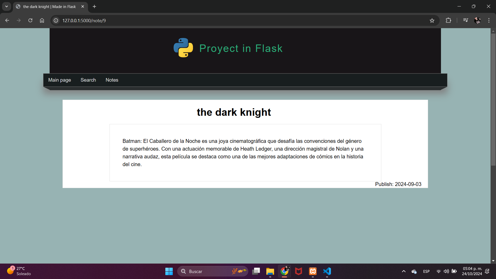
6. **Login Page**  
    View of the login page, where the user logs in.
    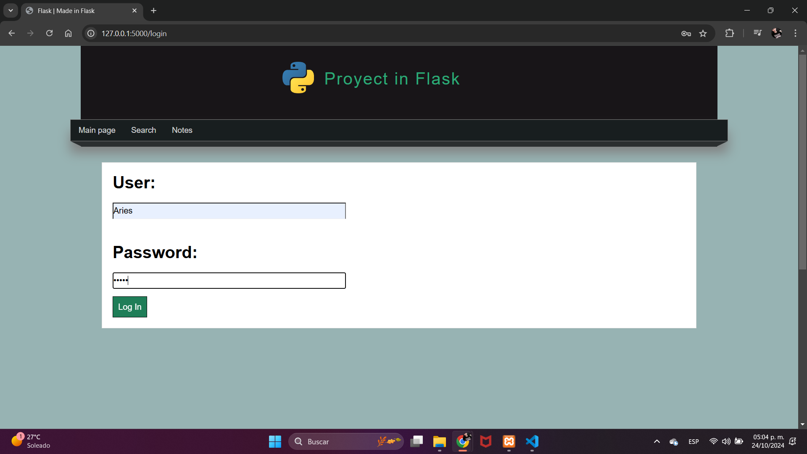
7. **Logview.**  
    View of the main page when a user logs in, the only difference is the new button with the users name and the welcome.
    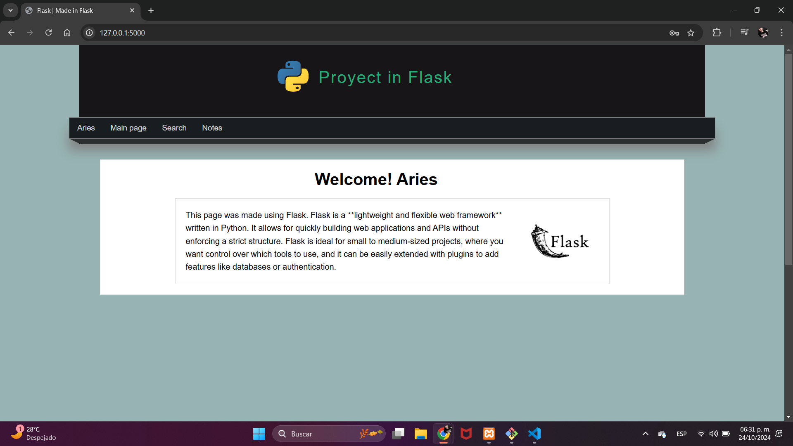
8. **Options User.** 
    Options user's view, only option to view profile's user and log out.
    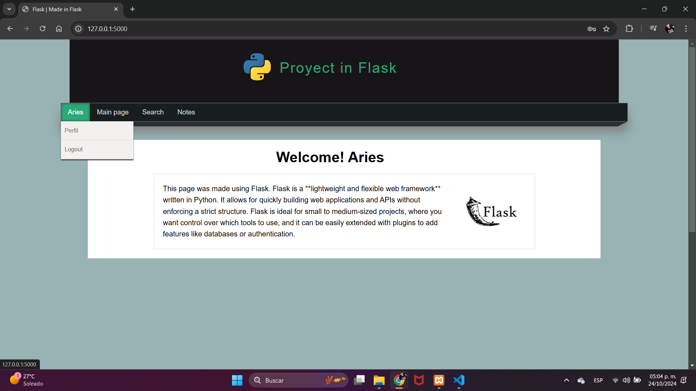
9. **User Profile.**   
    User's profile view where there is only data and the option to create a new note.
    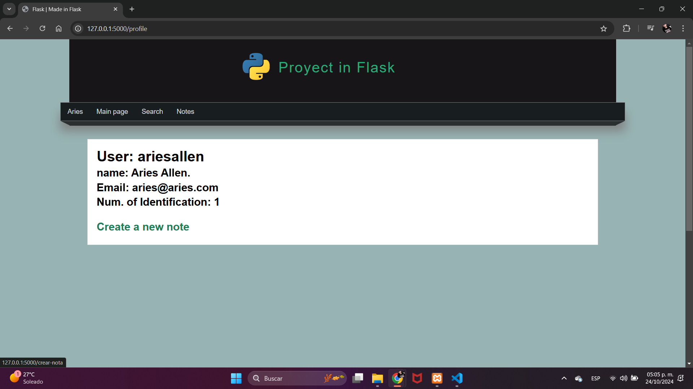
10. **Create Note.**  
    Creation note's view.
    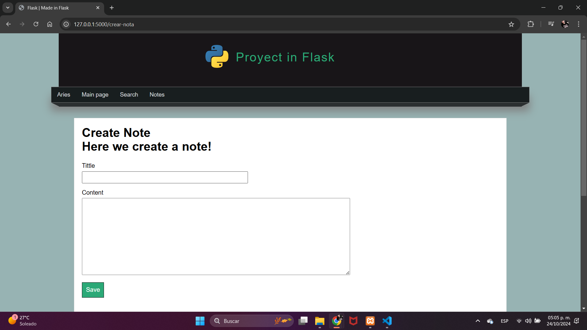
11. **Footer.**   
    Footer view where you can see the page navigator, which is dynamic according to the number of available pages.
    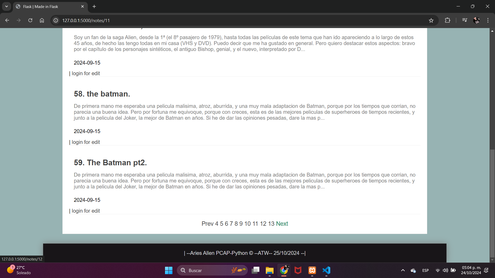

